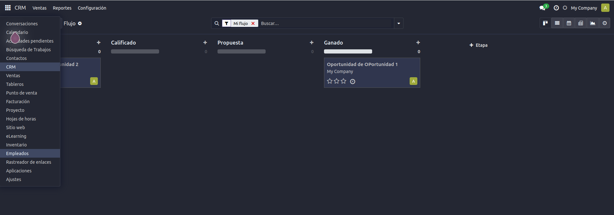

## Modo Oscuro - Odoo 18

Este módulo permite a los usuarios activar un **modo oscuro** dentro del entorno backend de Odoo 18, mejorando la experiencia visual, especialmente en entornos de poca luz.

## ✨ Características

- Activación del modo oscuro para la interfaz backend.
- Estilo personalizado con soporte SCSS y recursos estáticos.
- Compatible con Odoo 18.
- Fácil de instalar y mantener.

## 📦 Instalación

1. Copiar el módulo `mode_dark_module` en el directorio de addons de tu instancia Odoo.
2. Activar el modo desarrollador.
3. Actualizar la lista de aplicaciones.
4. Buscar **Modo Oscuro** e instalar.

## 🧩 Dependencias

- `base` (módulo nativo de Odoo)

## 🔧 Uso

Una vez instalado, el módulo aplica estilos personalizados al backend de Odoo para mostrar una interfaz en modo oscuro. Puedes personalizar los estilos en la carpeta `static`.

## 🧑 Autor

**Breithner Aquituari**

## 📝 Licencia

Licencia: **LGPL-3.0**
